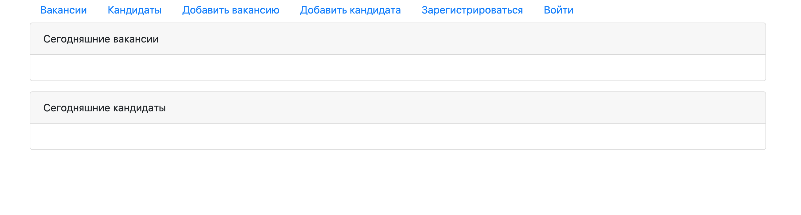
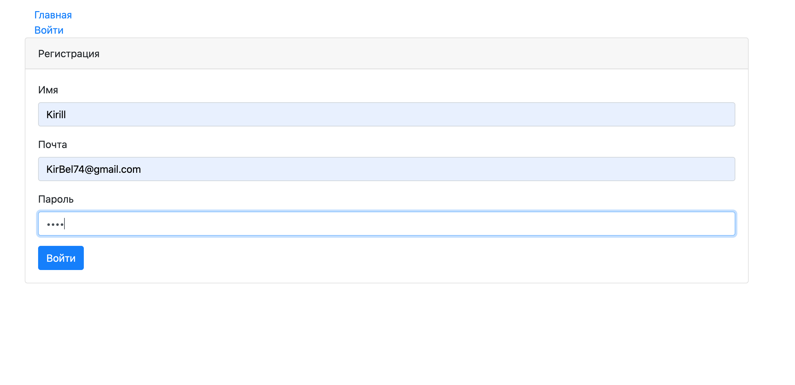
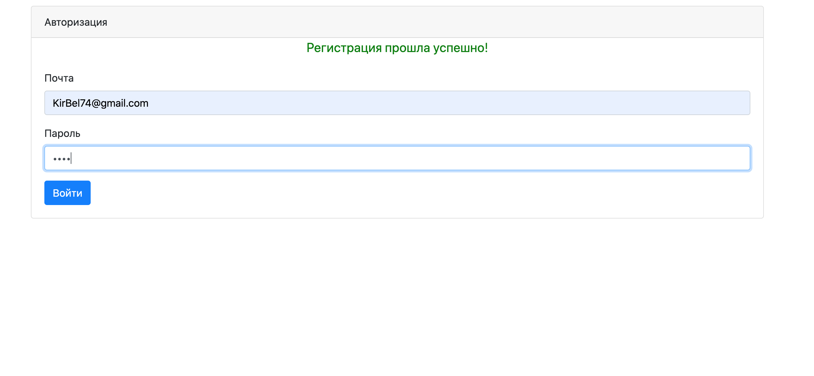
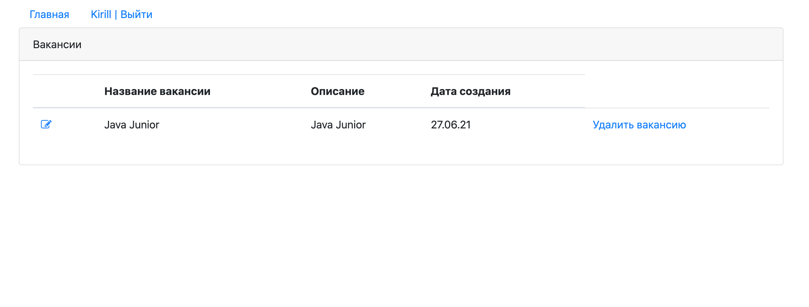
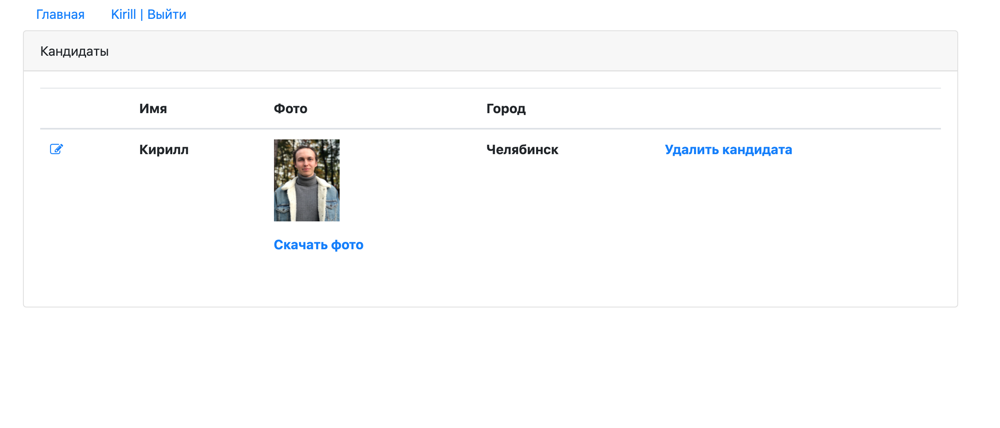

## Проект курса [job4j](http://job4j.ru)

### Работа мечты

Добавление/редактирование/удаление вакансий/кандидатов.
Не зарегистрированым пользователям доступны вкладки - главная, регистрация, авторизация.
Кандидатам есть возможность загрузить фотографии. 

Технологии:
- PostgresSQL
- JDBC
- Apache Tomcat
- Apache FileUpload
- Servlet
- JSP / CSS / JS / JSTL / HTML
- JUnit
- Ajax
- Log4j
- Singleton (On Demand Holder Idom)

Главная страница

Регистрация пользователя

Авторизация пользователя

Список вакансий

Список кандидатов
